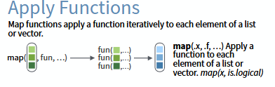
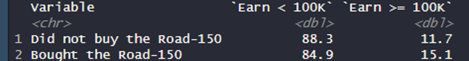

{width="260"}

This exercise is not complicated and involves basic data management functions you should know (if you are looking to work in data science) and be able to use without the help of an LLM.

If you don't know how to use a function, look for it yourself in the documentation.

## Dataset

Data comes from AdventureWorks, a sample of a database made by Microsoft used for training to design SQL server databases, using data from the Adventure Works brand.

There are 10 tables in the database:

- Calendar: with a range of dates

- Customers: customer data, with their name, income, number of children, education level…

- Products

  - Main table: information about products sold by AdventureWorks, name of product, cost, color, price

  - Subcategories: categories of products

  - Categories: categories of products

- Returns: returned products

- Sales (2015, 2016 and 2017): sales with the information about the product, customer who bought it, how many, date and where it was bought

- Territories: information about geographical locations (region, country, continent)

## Imports

```{r}
library(tidyverse)
```

## Question 1

Import all the .csv tables and have a look at the data

::: callout-warning
## `read.csv()` and `read_csv()`

In programming, you will often find multiple ways (or functions) to achieve the same goal. `read.csv()` and `read_csv()` both import .csv files. **However, they do not return the same object!**

`read.csv()` is "base" R (native R), while `read_csv()` is from the Tidyverse package.

I advise you to use Tidyverse functions instead of base R.
:::

```{r}
df_calendar
df_customers
df_product_categories
df_product_subcategories
df_products
df_returns
df_sales_2015
df_sales_2016
df_sales_2017
df_territories
```

How many rows and columns are in each table?

```{r}

```

### Data cleaning section

Cleaning individual dataframes should be done first. If at a later question you need to modify data inside one of the dataframes you just imported, come back here.

Your code should **always** be structured so that modifications to your imported datasets are at the beginning.

```{r}

```

### Advanced facultative question

Use the `map()` function to import all .csv at once.



You need to identify: what function you need to use (inside `map()`), and to what elements this function should apply.

```{r}

```

## Question 2

There are three sales tables. Bind them all into one table. Call it `sales_all`.

```{r}
df_sales_all <- 
```

How many orders have been made over those three years?

```{r}

```

## Question 3

Merge the three products tables: products, products_categories and products_subcategories. What key(s) did you use to join the tables?

```{r}
df_products_all <-
```

## Question 4

Starting from `sales_all`, join it to your new products table, with the customers table, and the territories table.

```{r}
df_sales_prod_cust
```

How many rows are there? Why do you think the tables were split up in the first place?

```{r}

```

## Question 5

Starting from the customers table, left join it to the sales tables, the territories table, and the products table.

```{r}
df_customers
```

How many rows are there?

```{r}

```

Why is it different from the number of rows you had in the table from the previous question?

> 

What would you change or do to get the same number of rows?

> 

```{r}

```

## Question 6

How many customers earn over \$100,000? On which table should you check this?

```{r}

```

## Question 7

Is there missing data in the Customers table? How many rows have missing data? In which variable(s)?

```{r}

```

## Question 8

How many orders have been made from people with income over \$100,000?

```{r}

```

## Question 9

What is the average price of products bought by people with an income over \$100,000? Under \$100,000?

```{r}

```

Calculate the 95% confidence interval of these averages.

::: callout-tip
## 95% CI formula

$\overline{price} \pm 1.96*\frac{\sigma_{price}}{\sqrt{n}}$
:::

```{r}

```

Now do a t-test of difference in means using the `t.test()` function.

```{r}

```

## Question 10

Do a histogram of the distribution of prices of the models sold by Adventure Works. Use `ggplot()`.

## Question 11

What is the most expensive bike sold by the company? Among all customers, how many bought it? Give the number and the percentage.

## Question 12

Are there more high-earners who bought the most expensive bike, compared to lower-earners? Do a two-way table, using R (not Excel!), in this format:



The earnings variable should be in column, the binary variable indicating if the customer bought the most expensive bike in row, and row percentages should be shown (row percentages means that the percentages in a row should sum to 100)

```{r}

```

## Question 13

Export this table to a .csv (or .xlsx) file.

```{r}

```

## Question 14

Do a chi-squared test of independence to check if there is an association between high earnings and buying the most expensive bike.

```{r}

```