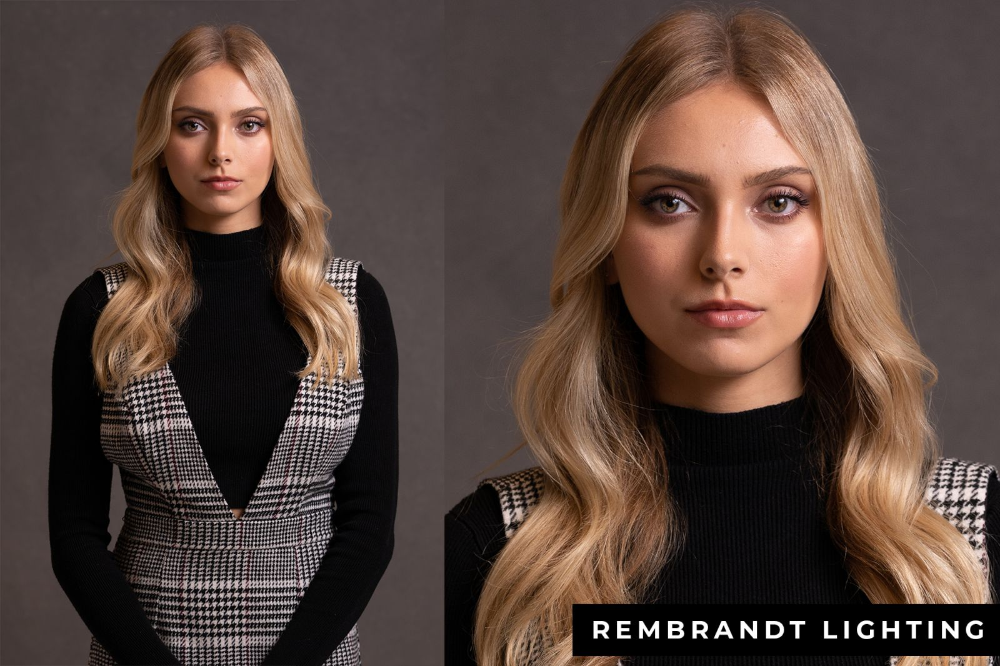
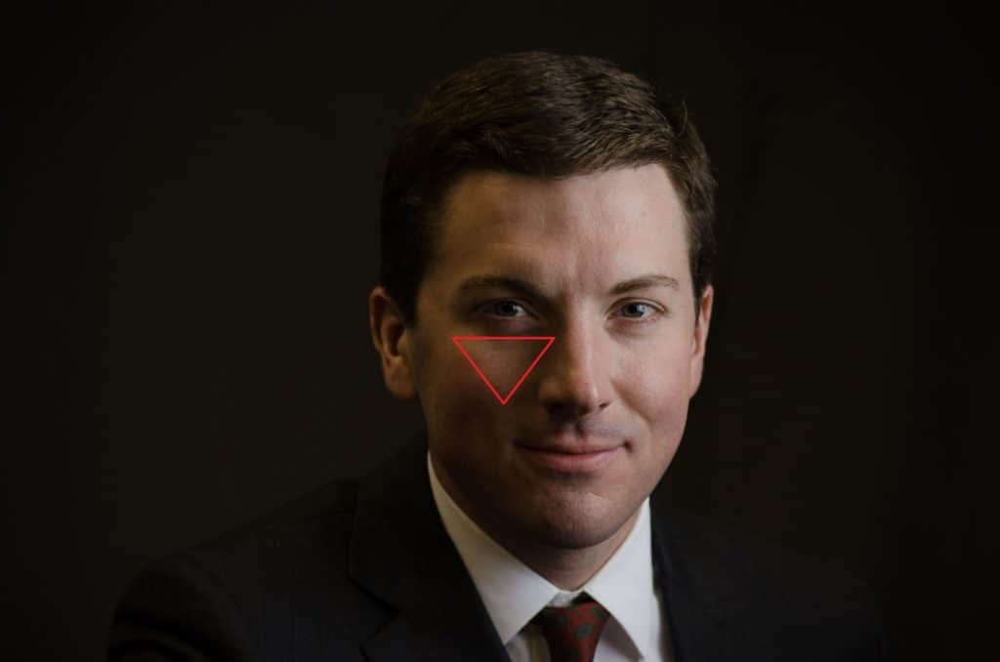

# Resume

This is the resume I used when I was switching jobs a few years ago. I got good feedback on it. Feel free to take inspiration from it, totally reuse the code, or just part of it.

There are small details in my resume that may require you to do some image editing yourself (like the colour of the icons, for example, or the round portrait). It's a good opportunity to learn how to use these tools; you might use them to modify your graphs in the future. (:

If you have more questions regarding resumes, send me an email.

## How to use

I did my resume on LaTeX, because it looks very clean --- it is the only time in my life I have used LaTeX. Otherwise I generally do not recommend using LaTeX: everybody uses Word, and nowadays you can write good looking equations using Word in the same way you write equations with LaTeX.

The LaTeX file is "resume EN.tex". You may have to download some packages, but the downloading/installing should be automatic when you compile the file (I use [MiKTeX](https://miktex.org/)).

## General tips

* Usually, put professional experience first if you are applying for a job, then education comes second
  * It's the opposite when you are applying for degree
* Put a link to personal project in the digital version of your resume (a final project that you did for a class, for example). If you feel it can help your application, link the final assignment you did for my class (that's actually one of the reasons why I'm making you do one). A R Shiny application can also look great
* Including some quantified results from your work, in your professional experience section, is usually a good idea (e.g. I put the number of papers I've co-authored)
  * If you don't have any professional experience that you think is relevant at the moment, that's fine. You're just looking for an internship right now. But when you will be applying for your first job, try to put some results/achievements from your internship
* Be wary of small mistakes/details: double spaces, poorly aligned paragraphs, typographical errors, mismatching fonts/colours/spacing between paragraphs... Recruiters may not notice one or two mistakes, but they quickly pile up if you are not careful enough. Attention to detail is a great skill to have.

## Icons

There are several icons that I use here. Initially, I found icons online in the .svg format. I opened them with Inkscape, modified their color such that they match the dominant color that I use in my resume, and then exported them as images.

## Picture

French resumes typically have pictures. If you decide to use one, aim for a picture with a neutral background (outdoors is great, as long as the background is not distracting), avoid having a too stark light/shadow contrast on your face. If you want to be fancy with your lighting and add a bit of depth to your picture, the easiest thing to do is Rembrandt lighting (you can achieve that with a single, cheap Ikea light, or with natural sunlight coming from a window):

To get that, light should come at a ~45 degrees angle. Move the light (or reposition yourself) until you get a triangular shape under one of your eyes.

As for posing, just look online for a pose that seems fine to you, search something like "corporate headshots posing". As for my very basic personal advice: shoulders back, keep your back straight, elongate your neck like if you had a string attached to the top of your head pulling you upward, don't look straight into the camera/lens/phone but beyond, and [smile with your eyes](https://www.wikihow.com/Smile-With-the-Eyes) (posing is actually hard and requires some training, there are books about it).

Note: my latex file does not automatically crop your image into a circle. The image I used is actually a square image, with white corners. To do this with one of your own image: open it in some image editor (I use Photoshop, Gimp works too), crop your image in a square, then use an ellipse selection tool to create a circle inside it. Invert the selection, then use the brush tool to paint the corner of your image in the colour of the background of your resume (white, usually)

Some corporate pictures that I shot:

For the two following pictures: single flash coming from the right. Notice the catchlight in the eyes: that's when you know your lighting is correctly positioned.

For this one: key flash coming from the left, fill light on the right to lessen the shadows
.jpg)

You don't need to buy a whole lighting kit and a DSLR. You can achieve good results with a phone and natural light.